## Lecture 3: GPIO Deep Dive and Abstraction Costs 

__Learning outcomes:__
* Understanding of abstraction overheads in Embedded Systems
* Understanding the limits of hardware interacting with I/O
* A deeper appreciation of memory-mapped I/O, expanding on the introduction from last lecture.
* Bit-manipulation techniques in C

---------------------------------------------

## Generating a Square Wave 

In this Lecture we will look deeply at the General Purpose Input Output (GPIO) pins of our TinyPico device.

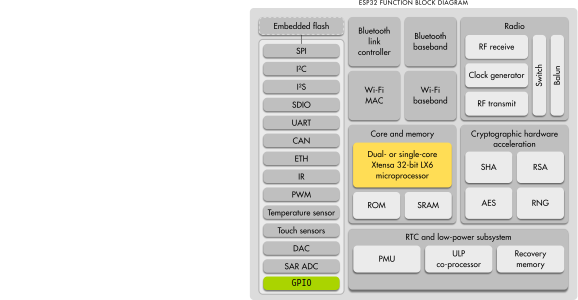

The TinyPico has 34 physical General Purpose Input Output (GPIO) pins, sometimes referred to as pads. 
These pins can be connected to various hardware peripheras in our ESP32, such as communication protocol hardware like UART or I2C. 
In this lecture we are going to try and push the GPIO of our TinyPico to it's limits and look underneath the hood.  

__Experimental Setup:__


### Recap of last lecture

Last lecture we looked at how software can interact directly with hardware through reading and writing to memory addresses.

## Experiment 1: Toggle a pin as fast as possible

Let's write a quick Arduino sketch to toggle a pin:

```C
void setup() {
    pinMode(23, OUTPUT);
}


void loop() {
    digitalWrite(23, HIGH);
    delay(500);
    digitalWrite(23, LOW);
    delay(500);
}
```

Let's recap what all of this means:
* ``pinMode(23, OUTPUT);`` -- this function setup the GPIO pin 23 as a digital output
* ``digitalWrite(23, HIGH);`` -- this function writes a ``HIGH`` value to pin 23 (+5v/+3.3v)
* ``digitalWrite(23, LOW);`` -- this function writes a ``LOW`` value to pin 23 (0V)
* ``delay(500)`` -- this function delays the execution of the ESP32 by 500ms

Let's look at the LA (Logic Analyser) trace to see what this looks like: 

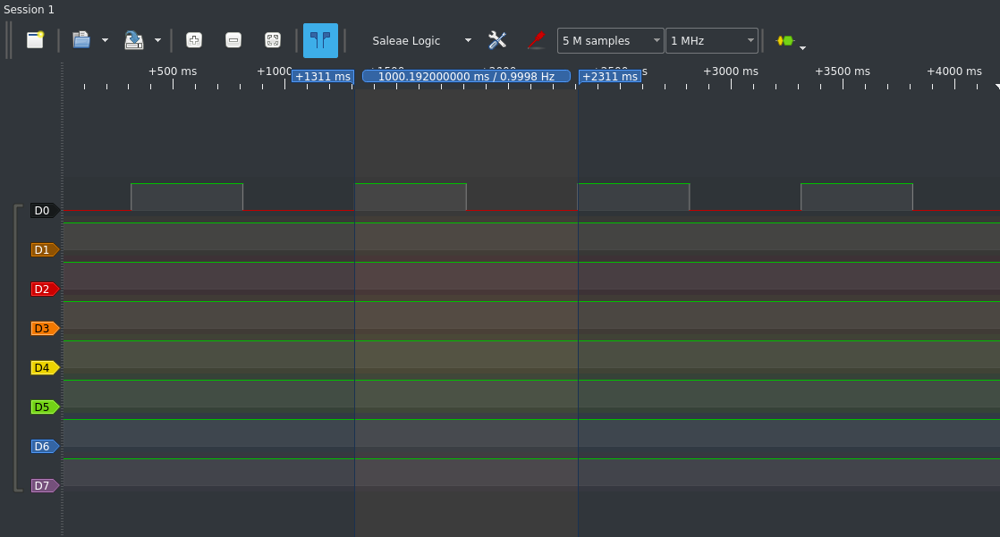

Measuring the period of the wave we can see that we get a square wave on channel 0, which is monitoring pin 23 of our TinyPico. This square wave is roughly 1 Hz, which makes sense, we are keeping the signal high for 500ms and low for 500ms and 1/(1000ms) = 1 Hz. However, we are not exactly at 1 Hz but rather 0.998Hz, why do you think that is?

The reason for this is because of the small overheads involved in the various bits of code that we have written. We will have:

* __function call overheads:__ when we call functions such as ``digitalWrite()`` or ``delay()``.
* __looping overheads:__ when we reach the end of our ``loop()`` function we have a branch instruction where our ``loop()`` function is called again. 

You'd expect these to be small, afterall our ESP32 is running at ``240MHz``. But it's effects are still measurable even when only generating a 1Hz wave.

__Let's see what happens when we try to go as fast as we can__

To make the square wave oscillate faster the first thing we should do is remove the calls to ``delay(500);`` in the loop body. Let's see what waveform the following code produces:

```C
void setup() {
    pinMode(23, OUTPUT);
}


void loop() {
    digitalWrite(23, HIGH);
    digitalWrite(23, LOW);
}
```

Capturing and measuring this signal on pulseview we get the following:

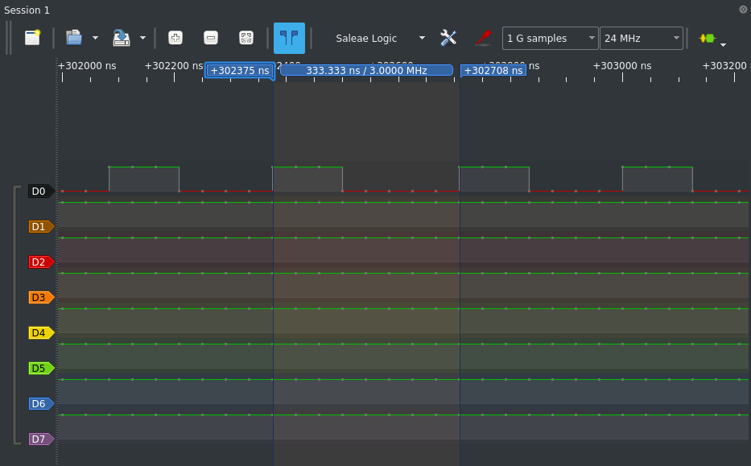

__As expected this is much faster.__ We now have a square wave that is oscillating at pretty much exactly 3MHz. However, we can notice some slightly odd things about this waveform, the amount of time LOW is greater than the amount of time HIGH. In electronic engineering speak, this is called the _mark-to-space_ ratio.

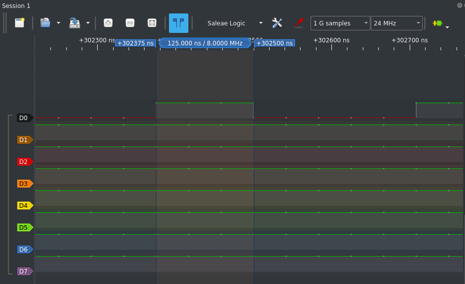

Focussing just on the time that the pin spends high we can see that it remains high for 125ns.

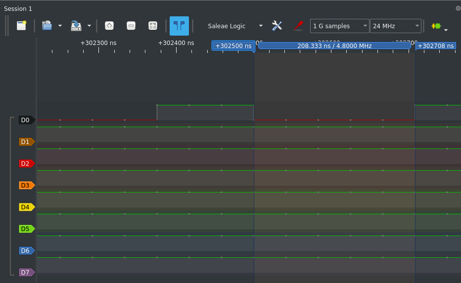

And if we look at the amount of time that the pin spends low, we can see that is is low for 208.33ns.
This makes sense if we think about the overheads that we still have remaining:
* __Function call overheads__ -- incurred from calling ``digitalWrite(23, HIGH)`` and ``digitalWrite(23,LOW)``.
* __Loop overheads__ -- incurred from the branch operations and recalling of the ``loop()`` function within Arduino

In the code the following is happening, starting from the very top of the ``loop()`` function body:
1. We call the ``digitalWrite(23, HIGH);`` function.
2. After some delay, due to the function call overhead, pin 23 goes __HIGH__ at the output.
3. We call the ``digitalWrite(23, LOW);`` function.
4. After some delay, due to the function call overhead, pin 23 goes __LOW__ at the output. 
5. We exit the loop function
6. In the Arduino runtime (currently invisible to us) there is a branch instruction, i.e. the ``loop()`` function is called within a loop.
7. The Arduino runtime calls our ``loop()`` function.
8. After some delay, due to the ``loop()`` function call overhead, we are back at position 1

Points 6,7, and 8 combine to form the __loop overheads__ I was discussing above. What we can see is that after the pin has been set low these loop overheads increase the length of time that the signal is low for. What if we flip the order of our ``digitalWrite()`` calls and execute this code instead:

```C
void setup() {
    pinMode(23, OUTPUT);
}


void loop() {
    digitalWrite(23, LOW);
    digitalWrite(23, HIGH);
}
```

In this case we get the following waveform: 

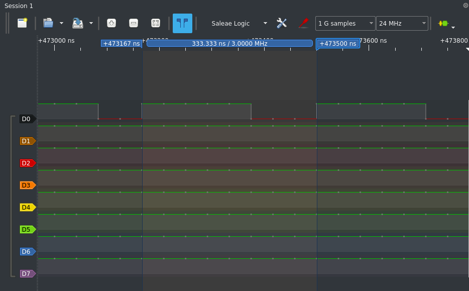

As expected, now the loop overheads are being added to the time that the pin is spent high. 

The difference in the mark to space ratio allows us to calculate our first estimate for the __loop overheads__ of our system, by simply calculating the difference between our time spent HIGH and LOW.

In the case above the signal is high for 208.33ns and is low for 125ns, giving us an estimate of 83.33ns overhead for the loop call.
 
The time the signal is low is the ``digitalWrite()`` function call overheads which is 125ns.

## Experiment 2: Multiple concurrent square waves

The ESP32 has many pins, what if we want to try and toggle multiple pins as fast as we can.
Let's try and generate two square waves.

```C
void setup() {
    pinMode(23, OUTPUT);
    pinMode(19, OUTPUT);
}


void loop() {
    digitalWrite(23, HIGH); 
    digitalWrite(19, HIGH);
    digitalWrite(23, LOW);
    digitalWrite(19, LOW);
}
```

Which gives us the following waveform:

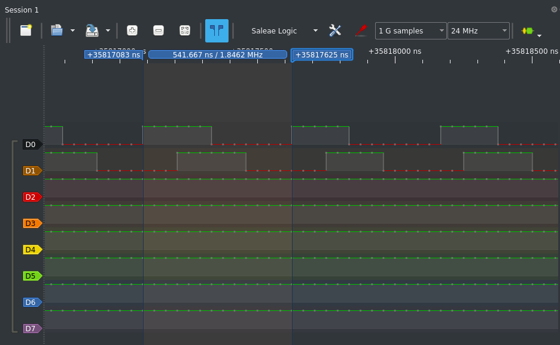

We can see now that we now have two waves but the maximum frequency is significantly reduced, giving us an maximum freuquency of 1.85 MHz. This is becasue each signal is essentially held HIGH now for two function call overheads.

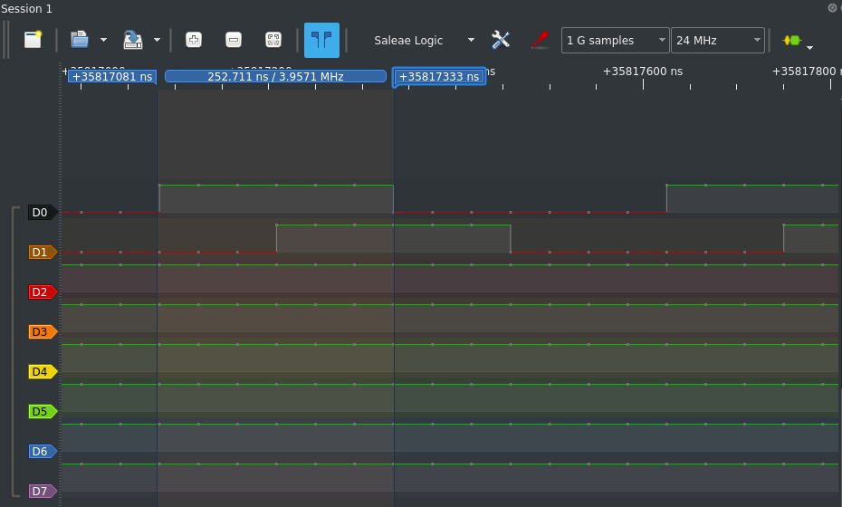

We measured earlier that each function call overhead is 125ns, and we can see here that the pulse is high for ~250ns = 125ns + 125ns.

Using our measurements for the function call and loop overheads we can estimate what the maximum frequency for some code generating 4 square waves will be.

```C
void setup() {
    pinMode(23, OUTPUT);
    pinMode(19, OUTPUT);
    pinMode(18, OUTPUT);
    pinMode(5, OUTPUT); 
}


void loop() {
    digitalWrite(23, HIGH);
    digitalWrite(19, HIGH);
    digitalWrite(18, HIGH);
    digitalWrite(5, HIGH); 

    digitalWrite(23, LOW);
    digitalWrite(19, LOW);
    digitalWrite(18, LOW);
    digitalWrite(5, LOW); 
}
```

The total time taken for the loop will be 8 ``digitalWrite()`` calls, and 1 loop overhead. Which is 8\*125ns + 83.33ns = 1083ns = 1.08us

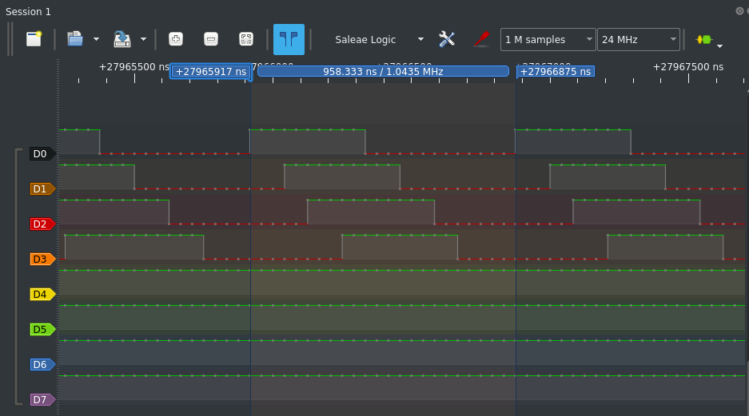

The actual value is 958.33ns which is a little bit lower than our estimate, but it's in the right ball park. 

From these experiments we can see that to generate square waves from our TinyPico with the Arduino functions the highest frequency we can generate is 3 MHz. We have also seen that as we increase the number of waves that we are generating means a linear reduction in the maximum frequency that we can generate.

What is stopping us from generating faster square waves?

## The Cost of Abstraction

The Arduino library aims to structure itself in such a way that code can be portable across devices.
For example, the ``digitalWrite()`` function is called the same way, whether you are compiling to an ESP32, an AVR chip, or something else.
This abstraction is powerful, it allows for a programmer to learn one set of function calls, and be able to target many devices. 
Without this abstraction, learning, or writing code for many differrent devices can be tedious, challenging, and error prone, as the underlying hardware of different devices can have many different quirks.
Take a simple operation like setting a pin high; for some devices, you may just have to write to a single memory mapped address. However, for others you might have to manipulate complicated switching networks to route your signals to the pins.
The Arduino abstraction hides all these details and provides a simple ``digitalWrite()`` frontend for whatever hardware you are targetting. Great.
However, this increase in portability and ease of use comes at a price in terms of performance.


To quantify the cost of this abstraction for the ``digitalWrite()`` function call we need to look into how GPIO pins are toggled on the ESP32 device.

Looking at the Technical Reference Manual (TRM) for the ESP32 we can find a set of registers that are used to interact with the GPIO of the device.

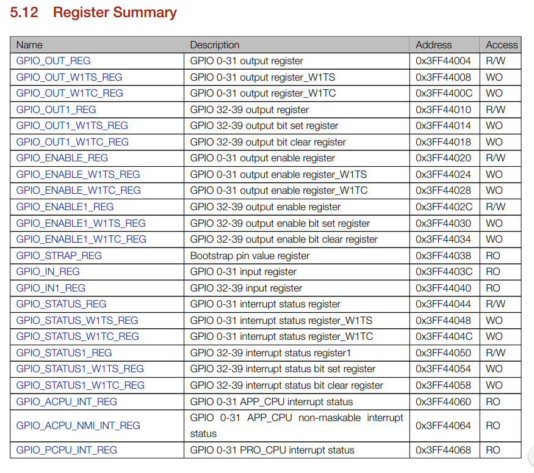

We are going to write directly to these registers in order to directly manipulate the GPIO ports, bypassing the Arduino abstractions. 

To do this we will need to examine the hardware mapped addresses of these registers that are used to manipulate the GPIO pins and read and write to them with pointers. If you are not yet familiar with C pointers and how they can be used to interact with memory-mapped hardware, please refresh the notes from last weeks lecture [[here](https://github.com/STFleming/EmSys_LabIntro_MemoryMappedHardware)].

The registers that interest us are ``GPIO_ENABLE_REG``, ``GPIO_OUT_REG``, ``GPIO_OUT_W1TS_REG``, and ``GPIO_OUT_W1TC``.

| Register name     | Address    | R/W | Width| Info |
|-------------------|------------|-----|-------|------|
| GPIO_ENABLE_REG    | 0x3FF44020 | R/W | 32  | bits 0-31 of this register can be set/cleared to enable/disable GPIOs 0-31 |
| GPIO_OUT_W1TS_REG  | 0x3FF44008 | WO  | 32  | setting bits 0-31 of this register will set the corresponding GPIOs (0-31) to go HIGH |
| GPIO_OUT_W1TC_REG  | 0x3FF4400C | WO  | 32  | setting bits 0-31 of this register will set the corresponding GPIOs (0-31) to go LOW      |

Let's think about how the Arduino code will use these registers, starting with our ``setup()`` function:

```C
void setup() {
    pinMode(5, OUTPUT);
}
```

In the function call ``pinMode(23, OUTPUT)`` we are telling Arduino to set GPIO pin 23 as an output. To do this, the implmentation of ``pinMode(pin, OUTPUT)`` for the ESP32 will need to interact with the ``GPIO_ENABLE_REG`` to enable the GPIO pin, setting the appropriate bit.

In the example about we want GPIO 5 to be enabled, which means we need to set bit 5. Now of course, we could just write ``unsigned int 32`` into this register, which would be ``0b00000000000000000000000000100000`` in binary, but this would disable all the other GPIO pins. What if we had some pins that were already enabled that we don't want to disturb?

Luckily C has some excellent __bitwise__ operations that we can use to individually 

### Bit Manipulation in C

You'll find bitwise operations everywhere in embedded C code, they are cheap, powerful, and when dealing with memory-mapped hardware registers essential. A bitwise operation allows the developer to write code that can set or clear many individual bits in one operation. 

| Operation  | Info                                                                                 |
|------------|--------------------------------------------------------------------------------------|
| ``a & b``  | Takes ``a`` and ``b`` and does an __AND__ on every individual bit of the two numbers |
| ``a \| b`` | Takes ``a`` and ``b`` and does an __OR__ on every individual bit of the two numbers  |
| ``a ^ b``  | Takes ``a`` and ``b`` and does an __XOR__ on every individual bit of the two numbers |
| ``a << X`` | Takes ``a`` and __shifts__ all the bits along to the __left__ by ``X``             |
| ``b >> X`` | Takes ``a`` and __shifts__ all the bits along to the __right__ by ``X``             |
| ``~a``     | Inverts all the bits of ``a``                                                        |

In our code we want to enable only GPIO 5 and we don't want to accidentally disable any other GPIO pins by writing a __0__ into their location. We can use some of the bitwise operations above to do this.

First we have to create a pointer to the ``GPIO_ENABLE_REG``. Looking at the TRM we can see that the memory-mapped address is ``0x3FF44020`` so we can create a pointer for this address. 

```C
unsigned int *gpio_enable_reg = (unsigned int*)(0x3FF44020);
```

The next thing that we want to do is read the value from this pointer, which will tell us all the pins that are currently already enabled.

```C
unsigned int *gpio_enable_reg = (unsigned int*)(0x3FF44020);
unsigned int gpio_initial_values;

void setup() {
    Serial.begin(115200);
    gpio_initial_values = *gpio_enable_reg; 
    Serial.println(gpio_initial_values, BIN);
}
```

We can do this simply by dereferencing the hardware pointer we created.

On my board when I run this code I get the following output:
```
110000000000110000110111000010
```

Where we can see that there are some bits enabled, however, bit 5 is not. What we want to do is set bit 5 without disturbing the other bits, which we can do with the following:

```C
unsigned int *gpio_enable_reg = (unsigned int*)(0x3FF44020);
unsigned int gpio_initial_values;
unsigned int gpio_new_values;

void setup() {
    Serial.begin(115200);
    gpio_initial_values = *gpio_enable_reg; 
    Serial.println(gpio_initial_values, BIN);

    gpio_new_values = gpio_initial_values | (1 << 5);
    Serial.println(gpio_new_values, BIN);
}
```

The line ``gpio_new_values = gpio_initial_values | (1 << 5);`` is the line of interest here. Let's start with the ``(1 << 5)`` part. Here we are taking a value, ``1``, which in binary is ``0b00000000000000000000000000000001`` and we are shifting it 5 places to the left to get ``0b00000000000000000000000000100000``.

The next thing we do is a bitwise OR between ``gpio_initial_values`` and our shifted value ``(1 << 5)``.With the bitwise OR if a bit at either input is __1__ then the output is __1__. 

```
0b00110000000000110000110111000010 // gpio_initial_value
0b00000000000000000000000000100000 // 1 << 5
----------------------------------
0b00110000000000110000110111100010 // gpio_initial_value | (1 << 5)
```

This will give us all the initial bits of the GPIO, as well as out newly set bit 5.
The final thing we need to do is write our new GPIO pins value into the ``GPIO_ENABLE_REG`` by dereferencing our ``unsigned int *gpio_enable_reg``.

```C
unsigned int *gpio_enable_reg = (unsigned int*)(0x3FF44020);
unsigned int gpio_initial_values;
unsigned int gpio_new_values;

void setup() {
    gpio_initial_values = *gpio_enable_reg; 
    gpio_new_values = gpio_initial_values | (1 << 5);
    *gpio_enable_reg = gpio_new_values;
}
```

## Flipping bits

Now that we have our pin enabled the next thing that we need to do is to change it's value as fast as we can. To do this we will be using the ``GPIO_OUT_W1TS_REG`` and the ``GPIO_OUT_W1TC_REG`` hardware registers. 

One thing to pay attention to is the naming convention here. ``W1TS`` stands for _"write 1 to set" and ``W1TC`` stands for _"write 1 to clear"_. This is a good example of how hardware memory mapped addresses can be have differently to you typical memory addresses. For the ``W1TS`` if we write a __1__ into a particular bit, then that bit is set. However if we write a __0__ into a ``W1TS`` register, then the value is not cleared. In order to clear a bit the value we would need to write a __1__ into the appropriate location in the ``W1TC`` register.

To set the GPIO pin 5 high we can use

```C
// GPIO enable
unsigned int *gpio_enable_reg = (unsigned int*)(0x3FF44020);
unsigned int gpio_initial_values;
unsigned int gpio_new_values;

// W1TS GPIO register
unsigned int*gpio_w1ts_reg = (unsigned int*)(0x3FF44008);

void setup() {
    gpio_initial_values = *gpio_enable_reg; 
    gpio_new_values = gpio_initial_values | (1 << 5);
    *gpio_enable_reg = gpio_new_values;
}

void loop() {
    *gpio_w1ts_reg = (1<<5);
}
```

We get a pointer to the ``W1TS`` register with ``unsigned int* gpio_w1ts_reg = (unsigned int*)*(0x3FF44008);``, then we write a __1__ into bit 5 with ``*gpio_w1ts_reg = (1<<5);``.

It's a similar story for clearing the bits

```C
// GPIO enable
unsigned int *gpio_enable_reg = (unsigned int*)(0x3FF44020);
unsigned int gpio_initial_values;
unsigned int gpio_new_values;

// W1TS GPIO register
unsigned int*gpio_w1ts_reg = (unsigned int*)(0x3FF44008);

// W1TC GPIO register
unsigned int*gpio_w1tc_reg = (unsigned int*)(0x3FF4400C);

void setup() {
    gpio_initial_values = *gpio_enable_reg; 
    gpio_new_values = gpio_initial_values | (1 << 5);
    *gpio_enable_reg = gpio_new_values;
}

void loop() {
    *gpio_w1ts_reg = (1<<5);
    *gpio_w1tc_reg = (1<<5);
}
```

We get a pointer to the ``W1TC`` register with ``unsigned int* gpio_w1tc_reg = (unsigned int*)*(0x3FF4400C);``, then we write a __1__ into bit 5 with ``*gpio_w1tc_reg = (1<<5);`` clearing the bit.


Compiling and uploading this code to our TinyPico generates the following waveform on pulsevie:

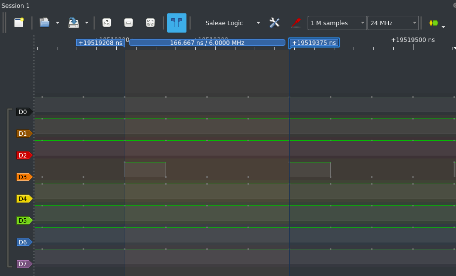;

We can see that is much faster, we now double our speed from 3MHz to 6MHz. We calculated earlier that our loop overheads are 83.33ns, so if we could remove them we would get the following:

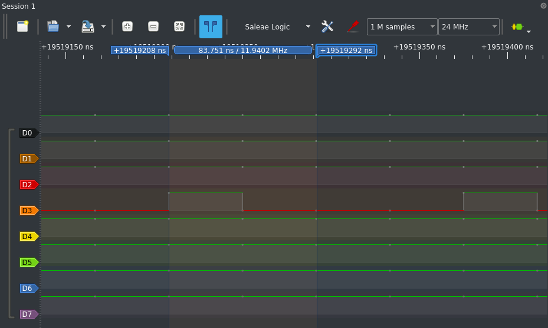

Which gives us a square wave with equal mark-space ratio running at almost 12MHz.


From this we can calculate the overhead of a call ``digitalWrite()``. Measuring the time spent high gives us:

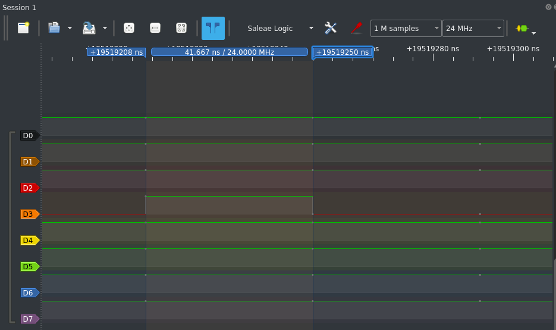

Previously we measured that the function call time took about 125ns, so if this raw register write takes 41.667ns, then the overall function call overhead is ~83ns, the same as our loop overheads.

## Multiple square waves using raw register writes

When reading the technical reference manual information on GPIO, one thing that you might notice is that it is possible to set or clear multiple bits in one write operation.

Consider the following code:

```C
// GPIO enable
unsigned int *gpio_enable_reg = (unsigned int*)(0x3FF44020);
unsigned int gpio_initial_values;
unsigned int gpio_new_values;

// W1TS GPIO register
unsigned int*gpio_w1ts_reg = (unsigned int*)(0x3FF44008);

// W1TC GPIO register
unsigned int*gpio_w1tc_reg = (unsigned int*)(0x3FF4400C);

void setup() {
    gpio_initial_values = *gpio_enable_reg; 
    gpio_new_values = gpio_initial_values | (1 << 23) | (1 << 19) | (1 << 18) | (1 << 5);
    *gpio_enable_reg = gpio_new_values;
}

void loop() {
    *gpio_w1ts_reg = (1 << 23) | (1 << 19) | (1 << 18) | (1 << 5);
    *gpio_w1tc_reg = (1 << 23) | (1 << 19) | (1 << 18) | (1 << 5);
}   
```

There are two main changes to the previous code:

```C
gpio_new_values = gpio_initial_values | (1 << 23) | (1 << 19) | (1 << 18) | (1 << 5);
```
This line is now setting bit 23, 19, 18, and 5 instead of just 5. Ensuring that we have 4 GPIO pins enabled.

And:
```C
*gpio_w1ts_reg = (1 << 23) | (1 << 19) | (1 << 18) | (1 << 5);
*gpio_w1tc_reg = (1 << 23) | (1 << 19) | (1 << 18) | (1 << 5);
```

Are now setting and clearing all those pins, not just pin 5. Compiling and uploading this to our TinyPico we get the following trace on our logic analyser:


That is quite a big difference from the case where we did multiple pins with ``digitalWrite()``. Again, this is the cost of abstraction. Arduino provides the same ``digitalWrite()`` function to all of it's devices. If one of its devices cannot change the state of multiple GPIO pins simultaneously then that restriction becomes the restriction in the abstraction for all devices.

__We are trading off performance for productivity.__ 

## Something strange

If we zoom out on our traces we can notice something unusual.

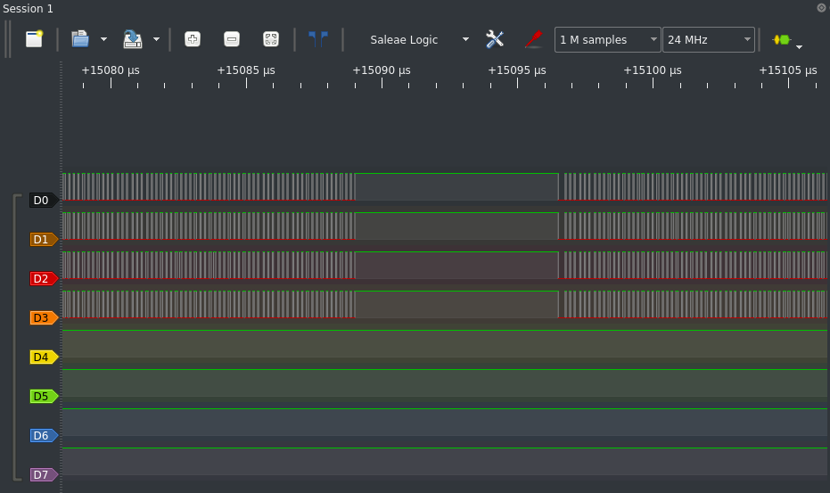

Periodically for relatively long periods of time our GPIO pins are held high or low. The reason for this is because the code we write for our TinyPico does not actually run directly on the hardware, but rather on a lightweight operating system called freeRTOS.


The ESP32 is a dual-core system and with Arduino the code that your write is place in a single task in of a freeRTOS running on the device. This task is excuted solely on ``Core0`` of the dual-core system, with ``Core1`` reserved for executing tasks related to networking and the WiFi stack. However, becasue we are observing such long interruptions to our arduino tasks in our program, the freeRTOS running on the device must be periodically scheduling a tasks to run out ``Core0`` pausing the execution of our code.

In later lectures we will look into this, and examine freeRTOS in detail. For now don't worry about fully understanding this, but it is good to have some idea of what is currently running on our TinyPico boards beneath the hood.

